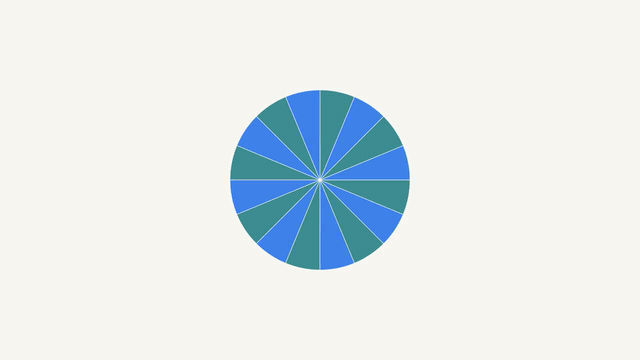
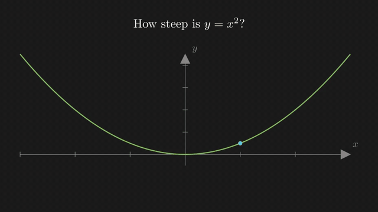
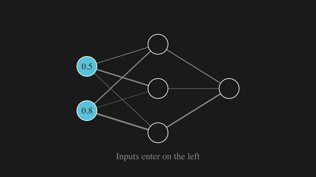
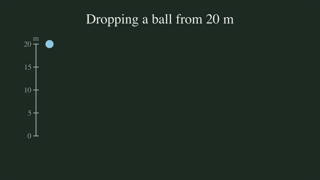
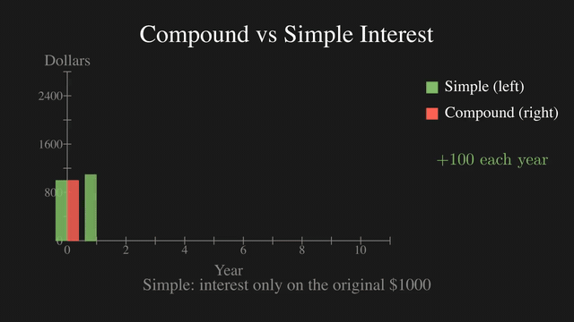
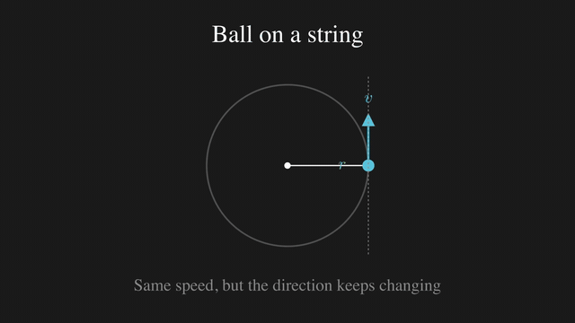
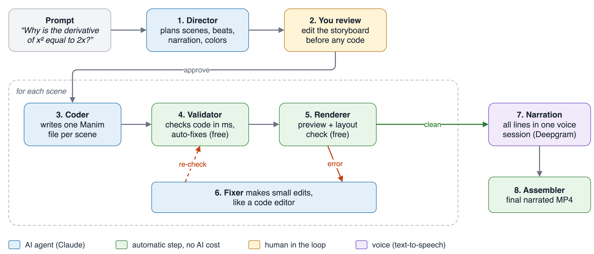
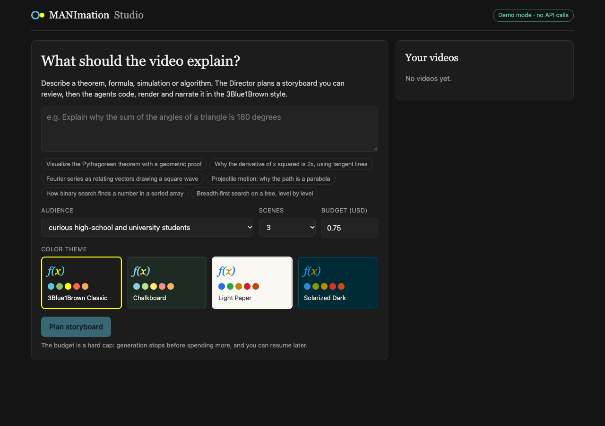
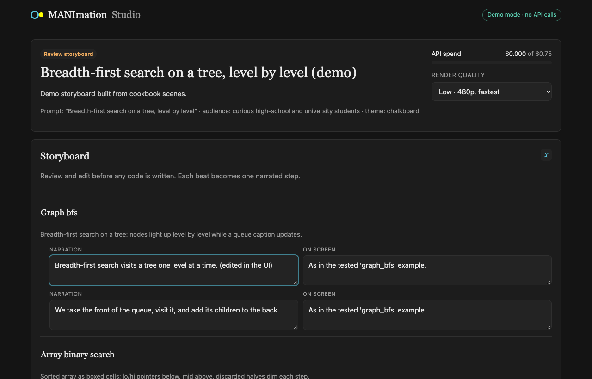

<div align="center">

# MANImation Studio

**Type one prompt. Get a narrated, 3Blue1Brown-style math video.**

A team of Claude agents plans a storyboard you can edit, writes one [Manim](https://www.manim.community/) scene per section,
renders it, repairs failures with small code edits, and voices the whole thing in one consistent narration.




<sub><i>“Why the area of a circle is πr². Cut a circle into 16 wedges, rearrange them alternately up and down into a near-parallelogram,
then increase to 64 wedges so it becomes a rectangle with width πr and height r. End on A = πr².”</i></sub>

</div>

---

## Showcase

Every clip below was generated end to end from the prompt shown under it: storyboard, Manim code, rendering, narration and assembly.
The GIFs are sped-up silent previews. **Click one to watch the full video with narration.**

<table>
<tr>
<td width="50%" valign="top">
<a href="docs/showcase/derivative.mp4"></a>
<p><b>Why d/dx x² = 2x</b><br>
<sub><i>“Why the derivative of x squared is 2x, shown with the slope of tangent lines”</i></sub><br>
<sub>2 scenes · 69 s · 3B1B theme · <b>$0.09</b></sub></p>
</td>
<td width="50%" valign="top">
<a href="docs/showcase/neural-network.mp4"></a>
<p><b>Inside a 2-3-1 neural network</b><br>
<sub><i>“A 2-3-1 neural network: input values flow left to right through weighted edges (edge thickness = weight), each neuron shows its activation, and the output appears. End holding on the full network.”</i></sub><br>
<sub>3 scenes · 101 s · 3B1B theme · <b>$0.12</b></sub></p>
</td>
</tr>
<tr>
<td width="50%" valign="top">
<a href="docs/showcase/free-fall.mp4"></a>
<p><b>Free fall: why falling things speed up</b><br>
<sub><i>“Free fall: a ball dropped from 20 m with snapshots every 0.5 s, the gaps between snapshots growing, alongside a position–time graph forming a parabola. End on h = ½gt²”</i></sub><br>
<sub>1 scene · 41 s · Chalkboard theme · <b>$0.06</b></sub></p>
</td>
<td width="50%" valign="top">
<a href="docs/showcase/compound-interest.mp4"></a>
<p><b>Compound vs simple interest</b><br>
<sub><i>“Compound interest: $1000 at 10% yearly for 10 years, shown as growing bars, compared with simple-interest bars beside them, with the gap highlighted at year 10.”</i></sub><br>
<sub>1 scene · 42 s · 3B1B theme · <b>$0.08</b></sub></p>
</td>
</tr>
<tr>
<td width="50%" valign="top">
<a href="docs/showcase/circular-motion.mp4"></a>
<p><b>Why does a ball on a string go in a circle?</b><br>
<sub><i>“Uniform circular motion: a ball moving on a circle with the velocity vector tangent and the acceleration vector pointing to the center. Then cut the string so the ball flies off along the tangent”</i></sub><br>
<sub>1 scene · 46 s · 3B1B theme · <b>$0.08</b></sub></p>
</td>
<td width="50%" valign="top">
<a href="docs/showcase/circle-area.mp4"></a>
<p><b>Why the area of a circle is πr²</b><br>
<sub><i>Prompt shown at the top of this page.</i></sub><br>
<sub>1 scene · 40 s · Light Paper theme · <b>$0.08</b></sub></p>
</td>
</tr>
</table>

Costs are the real Claude API spend recorded in each project's `usage.jsonl` (economy profile). Narration is Deepgram Flux TTS.

---

## How it works



| Step | Who | What it does |
|---|---|---|
| 1. **Director** | Claude | Turns the prompt into a storyboard: scenes, beats, narration lines, on-screen description and a color for every symbol |
| 2. **You review** | Human | Edit narration or visuals in the UI before any code is written |
| 3. **Coder** | Claude | Writes one Manim file per scene against a small themed toolkit (`manim_kit`) and tested cookbook examples |
| 4. **Validator** | Code (free) | AST checks, import allow-list, ManimGL→ManimCE auto-renames, LaTeX pre-compile, in milliseconds |
| 5. **Renderer** | Code (free) | Fast preview render plus a layout check (off-screen objects, overlapping text) |
| 6. **Fixer** | Claude | Repairs errors with small `str_replace` edits (never full rewrites) and re-renders until clean |
| 7. **Narration** | TTS | Records every line of the video in **one** Deepgram session so the voice stays consistent |
| 8. **Assembler** | ffmpeg | Final narrated render of each scene, concatenated into one MP4 |

Why it works reliably:

- **Per-scene code**: one bug never kills the whole video, and a single scene can be revised on its own.
- **Free checks first**: the validator, auto-fixes and layout checks run before any paid call.
- **Grounded generation**: the Coder writes against a themed helper library and a cookbook of 18 scenes that the test suite actually renders, and the Fixer gets real Manim signatures and known-error hints.
- **Hard budget**: every call is logged with its cost, the run stops *before* exceeding the cap, and it resumes from checkpoints without paying twice.

Full design notes: [docs/ARCHITECTURE.md](docs/ARCHITECTURE.md).

---

## The app

<table>
<tr>
<td width="50%"></td>
<td width="50%"></td>
</tr>
<tr>
<td align="center"><sub>Write a prompt, pick audience, scene count, budget and one of four color themes</sub></td>
<td align="center"><sub>Review and edit the storyboard before any code is written</sub></td>
</tr>
</table>

Live logs, per-scene previews, budget tracking, "revise this scene" requests and resume-after-credits-run-out are all in the UI.

---

## Quick start

### Option A: Docker (easiest)

```bash
git clone https://github.com/dhupthumbadiya2005/Manimation.git
cd Manimation
cp .env.example .env            # add ANTHROPIC_API_KEY (and optionally DEEPGRAM_API_KEY)
docker compose up --build       # open http://localhost:8000
```

Projects persist in `./data`. The first build downloads ~460 MB of LaTeX/ffmpeg packages (image ~3.1 GB). Downloads are cached, so re-running after a dropped connection resumes.

### Option B: Local

Requirements: Python 3.12 with [uv](https://docs.astral.sh/uv/), Node 22, ffmpeg, sox, cairo/pango and a LaTeX distribution.
On macOS: `brew install cairo pango pkg-config ffmpeg sox` plus [MacTeX](https://www.tug.org/mactex/).

```bash
cp .env.example .env

# backend
cd backend && uv sync
uv run uvicorn app.main:app --port 8000

# frontend (dev, hot reload) in another terminal
cd frontend && npm install && npm run dev      # open http://localhost:5173
```

Or build the UI once (`cd frontend && npm run build`) and open http://localhost:8000; the backend serves it.

### Try it without an API key

```bash
cd backend && MANIMATION_DEMO=1 uv run uvicorn app.main:app --port 8000
```

In demo mode the agents answer from the tested cookbook scenes, so the whole app (planning, coding, rendering, narration, UI) runs with no API calls and no cost.

---

## Configuration

All settings live in [`.env.example`](.env.example). The important ones:

| Variable | Default | Purpose |
|---|---|---|
| `ANTHROPIC_API_KEY` | — | Claude key (not needed in demo mode) |
| `DEEPGRAM_API_KEY` | — | Enables Deepgram Flux narration; without it, free Google TTS is used |
| `MANIMATION_TTS` | auto | `deepgram`, `gtts` or `silent` |
| `MANIMATION_TTS_VOICE` | `flux-priya-en` | Any [Deepgram Flux voice](https://developers.deepgram.com/docs/flux-tts/voices), e.g. `flux-naveen-en` |
| `MANIMATION_PROFILE` | `economy` | `economy` = Sonnet 5.5 for every agent; `quality` = Opus 5.5 for Director and Fixer |
| `MANIMATION_BUDGET_USD` | `0.75` | Hard spending cap per video |
| `MANIMATION_MAX_SCENES` | `3` | Upper limit on scenes per video |
| `MANIMATION_DEMO` | `0` | `1` = offline demo mode |

**Narration.** Only the final render is narrated (previews are silent). All lines of a video are recorded in one Deepgram session, so tone stays consistent across beats and scenes. Measured pitch drift across lines dropped from ~19 Hz to ~6 Hz compared with separate requests. The recording is reused until a narration line changes.

---

## Command line

```bash
cd backend
uv run python -m app.cli "Explain the Pythagorean theorem visually" --scenes 3 --budget 0.50
uv run python -m app.cli "..." --tts deepgram --voice flux-naveen-en
uv run python -m app.cli --resume ../data/projects/<id>          # continue after credits/budget ran out
uv run python -m app.cli "Bubble sort" --demo --quality low      # no API calls
uv run python scripts/eval.py --limit 5 --total-budget 2         # quality/cost evaluation
```

## Tests

```bash
cd backend && uv run pytest              # includes real renders of every cookbook scene; no API calls
cd frontend && npm run typecheck
```

## Project layout

```
backend/
  app/            FastAPI app, CLI, agents (pipeline/), Claude client + budget (llm/)
  manim_kit/      theme, layout zones, layout checks, base scene, helpers used by generated code
  knowledge/      tested cookbook scenes, toolkit reference, known-error hints
  scripts/        cookbook renderer, evaluation
frontend/         React + Vite UI
docs/             architecture, presentation, showcase videos
data/             projects (created at runtime, git-ignored)
```

## Acknowledgements

- [Manim Community](https://www.manim.community/) and [3Blue1Brown](https://www.3blue1brown.com/) for the visual language
- [TheoremExplainAgent](https://arxiv.org/abs/2502.19400) and [Code2Video](https://arxiv.org/abs/2510.01174) for the plan → code → repair research this builds on
- [Anthropic Claude](https://www.anthropic.com/) for the agents, [Deepgram](https://deepgram.com/) for the voice
